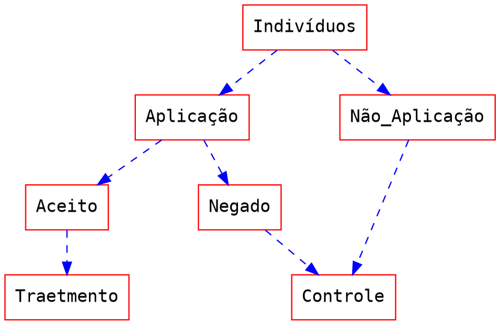

# Abordagem econométrica via escore de propensão

## Um olhar por dentro do modelo

Além da clássica métrica por Mínimo Quadrado Ordinários (MQO) nos modelos de regressões econométricas, a ferramenta de pareamento estatístico via escore de propensão é amplamente usada para desenvolver pesquisas na área de avaliação de políticas e mensuração do impacto de algum tratamento. A técnica do escore de propensão é utilizada quando a hipótese de distribuição aleatória do tratamento não é verificada. Nesse caso, ao usarmos o Mínimo Quadrado Ordinário, o coeficiente estimado não será o verdadeiro valor esperado, pois carregará dentro do valor calculado a correlação de não ser uma distribuição aleatória.

Mínimos Quadrados Ordinários:

$$ Y = \mathbb X\beta + \delta Tratamento + \mu $$

$$ \mathbb{E} (\delta) = \frac { \sum_{i=0}^n (Tratamento_i-\bar{Tratamento_i})y_i } {\sum_{i=0}^n (Tratamento_i-\bar{Tratamento_i})²} $$

Onde  **X** é uma matrix com $n$ variáveis e $i$ indivíduos e $\beta$ é um vetor com as inclinações dos parametros estimados. Nesse caso, quando o objetivo da análise é apenas calcular o resultado de um tratamento, a condição de primeira ordem traz $\delta$ como nosso parâmetro de interesse.

Condição de primeira ordem:

$$ \frac {\partial Y }{\partial Tratamento} = \ \delta $$

Em outras palavras:

$$ Efeito \ Médio =  \mathbb{E}(Y |tratamento= 0)  - \mathbb{E}(Y |tratamento= 1) = \delta$$ 

Para obter esse resultado, o tratamento não pode ser correlacionado com a ação de receber ou não receber o tratamento. A suposição de distribuição aleatória do tratamento implica que o valor esperado de ambos os grupos seria o mesmo se houvesse ou não recebesse o tratamento.

Matematicamente: 

$$ \mathbb{E}(Y_{(t-1)} | tratamento= 0)  - \mathbb{E}(Y_{(t-1)} | tratamento= 1) = 0 $$

Onde $(t-1)$ é o período antes do tratamento. É importante observar que, na maioria dos casos, o conjunto de dados não possui período anterior para comparar os resultados antes e depois da política. Se a pesquisa tiver esse tipo de dado que segue o indivíduo antes e depois da política, outros instrumentos, como Efeitos Fixos (EF) ou Efeitos Aleatórios (EA), poderiam ser mais eficientes do que o Propensity Score Matching.

O Propensity Score Matching vem como uma solução quando o conjunto de dados não seguem os indivíduos e se supõe que o tratamento não foi organizado de forma aleatória. A fim de remover o viés de seleção, do valor esperado do resultado, a técnica de pareamento tem como objetivo de randomizar artificialmente os indivíduos tratados e os não tratados base em suas características observáveis ($X$).

Para ilustrar esse caso, vamos supor uma política governamental que ofereça uma bolsa de estudos para alguns estudantes. Para receber essa bolsa, o aluno deve provar algum conhecimento fazendo algum teste. O sucesso nesta fase permite que o aluno receba a bolsa de estudos. Após a implementação da política, o político deseja conhecer o impacto da bolsa de estudos na qualidade do desenvolvimento de pesquisas. Para fazer isso, ele comparou os resultados de todos os alunos que não receberam bolsas, como controle, com os alunos que receberam a bolsa.

Agora, a questão que o pesquisador precisa refletir é: Seria razoável supor que o grupo de tratamento e o grupo de controle tenham a mesma qualidade esperada no desenvolvimento de pesquisas? Comparar os dois grupos, pois são semelhantes, implica que, sem o tratamento, o resultado esperado de ambos deve ser o mesmo. Em outras palavras, os alunos que aplicaram para receber a bolsa, e os alunos que não aplicaram para receber a bolsa são semelhantes no processo de desenvolvimento de pesquisas?

A probabilidade de participar do tratamento é baseado nas características do próprio indivíduo:

$$  Pr(\vec x_i) = \mathbb{P}(treatment= 1 |\vec x_i) $$

$$ \mathbb{E}(Y_{(treatment=1)} | \mathbb {X} )  - \mathbb{E}(Y_{(treatment=0)} | \mathbb X ) \neq 0 $$

Angrist and Pischke (2009) apontam que a estimativa pelo escore de propensão ocorre em duas etapas: primeiro, é estimada com algum modelo paramétrico, como *Probit* ou *Logit*. Então, a estimativa do efeito do tratamento passa a ser calculada combinando o valor encontrado na primeira etapa ou usando algum esquema de peso. Portanto, a técnica de escore de propensão, compara os efeitos nos grupos pareados, diferindo apenas pela variável de controle definida.

O pareamento por escore de propensão é uma ferramenta de correspondência estatística que tenta estimar o efeito médio do tratamento *(Average Treatment Effect, ATT)*, assumindo um provável viés de seleção. A probabilidade condicional de receber tratamento é calculada para tentar imitar um distribuição aleatória do tratamento, ou seja, produzir um experimento análogo à randomização, emparelhando indivíduos semelhantes com base nas características observadas, diferenciando-se apenas no tratamento. 

Enquanto a regressçao por Mínimos Quadrados Ordinários requer que o tratamento seja destribuido de forma randomizada, o escore de propensão supõe apenas uma hipótese de independência condicional. Esta suposição permite contornar o viés de seleção. 

A hipótese segue esta estrutura:

$$  \mathbb{E}(Y_{(t=0)} | \mathbb X, t ) = E(Y_{(t=0)} | \mathbb X ) $$
$$  \mathbb{E}(Y_{(t=1)} | \mathbb X, t ) = E(Y_{(t=1)} | \mathbb X ) $$
$$ \mathbb X_i \bot t_i | Pr(x_i)  \therefore  ( Y_{(0)}, Y_{(1)}) \bot t | Pr(x)  $$

Onde $t$ é o tratamento e $Pr(x)$ é o escore de propensão. Sendo dependentes do escore de propensão, as covariáveis são independentes da participação no tratamento. Portanto, para observações com os mesmos escores de propensão, a distribuição de covariáveis deve ser a mesma nos dois grupos. Dependendo do escore de propensão, cada indivíduo tem a mesma probabilidade de participar do tratamento, simulando assim a distribuição aleatória do tratamento.

$$ \tau_{att} = \mathbb{E} \Biggl[\frac{(t-Pr(x))y}{\delta(t-Pr(x))}\Biggl]  $$ 

$$ \hat\tau_{att}  =  \frac{ \sum_{i=0}^n [(t_i-\hat p(x))y_i] }{\sum_{i=0}^n [\hat \delta(t_i-\hat p(x))]} $$

Onde $δ = Pr(t=1)$ e:

$$  \hat \delta = \frac{1}{n} \sum_{i=0}^n t_i$$

 Dessa forma, qualquer diferença no resultado entre os indivíduos tratados e não tratados não é atribuível ao viés de seleção. Em seguida, calcula-se a diferença média dos resultados nos dois grupos para obter o verdadeiro efeito esperado do tratamento do programa.
 
Quando o ganho potencial da técnica do escore de propensão está relacionado a uma característica intrínseca e não observada, a técnica de pareamento não resolve o problema do viés de seleção e não torna a modelagem mais próxima do verdadeiro valor esperado. O método de pareamento pelo escore de propensão é limitado às variáveis presentes no banco de dados.

## Um exemplo do método de escore de propensão:

### Impacto do gênero na determinação de salários

Para ilustrar o que foi discutido acima, o exemplo a seguir se propõe a mapear o impacto de gênero e da maternidade no processo de determinação de salários. O exemplo compara a técnica da regressão sem o pareamento com o método de regressão com o escore de propensão. Supondo que todas as hipóteses sejam atendidas para cada valor do escore de propensão, a medida do Efeito Médio do Tratamento (ATT) convergirá para o verdadeiro valor esperado do tratamento, minimizando o efeito do viés de seleção. 

Um dos argumentos que sustenta a disparidade do salário é a existência de um fator discriminatório dos agentes econômicos, impondo um salário diferente para indivíduos com a mesma produtividade marginal. Para a análise, foram utilizados dados da Pesquisa Nacional por Amostra de Domicílios (PNAD/IBGE) do ano de 2015 e 2014.

Para a comparação dos efeitos, foram regredidos três modelos diferentes:

Sendo i igual ao grupo referente a faixa etária da criança e **X** uma matriz de características dos indivíduos da amostra, sendo elas: idade, idade ao quadrado, anos de estudos, anos de estudo ao quadrado, sul, sudeste, norte, nordeste, negro, branco, pardo, amarelo, vive com o cônjuge, experiência potencial e logaritmo natural da renda da casa. $Y$ é o logaritmo natural da renda do agente, e $\beta$  o parâmetro de inclinação determinado pelo modelo.

Em seguida, para criar o modelo de determinação de salários, foi transformado o valor do salário em escala de logaritmo natural. Isso aproxima a distribuição da amostra da distribuição normal, resultando em maior robustez dos resultados obtidos e proporcionando maior eficiência na inferência dos testes. Esta transformação é feita pois regressões podem ser influenciadas por distribuição de picos, outliers, escala, entre outros. Então, para aproximar uma distribuição normal, a aplicação da transformação pode se aproximar dessa distribuição. Observe que, apesar de perder a eficiência, o estimador PSM não precisa da suposição de normalidade para ser um estimador imparcial e consistente.

Como mostra a tabela anterior, na amostra geral, comparando homens e mulheres, após o método de pareamento, a diferença salarial aumenta, passando de -26\% para -38\%. O resultado indica que, quando os indivíduos são pareados pelo método do escore de propensão, a variável mulher é a única variável que se diferencia entre os grupos e, ao comparar indivíduos com as mesmas características sob o mesmo escore de propensão, ser mulher implicaria um salário de 38\% a menos do que homens, não apenas 26\%.

No segundo modelo, onde apenas homens e mulheres sem filhos são analisados, a disparidade também aumenta após o pareamento, de -17\% para -24\%. Apesar de ter uma magnitude menor, quando comparado ao modelo anterior, onde os salários dos homens são comparados aos de todas as mulheres, ainda existe uma diferença grande e estatisticamente significante entre a estimativa de MQO e a estimativa por escore de propensão.

No terceiro modelo, a análise é entre os salários de mulheres sem filhos e os salários das mulheres que são mães. De certa forma, não existe uma diferença tão grande no último grupo, em que mulheres sem filhos são comparadas com mulheres com filhos. Esse resultado pode ser consequência de uma amostra mais homogênea, na qual apenas as mulheres são comparadas. Este resultado é interessante pois ressalta que a necessidade do pareamento é mais crítica quando o modelo propõe comparar o impacto do tratamento entre grupos mais distintos.

### Conclusão

O objetivo deste estudo foi demonstrar e comparar os resultados obtidos ao regredir um modelo sem pareamento e um modelo com pareamento. Para estimar pelo escore de propensão, primeiro uma regressão logística foi criada para afim de encontrar a probabilidade de um indivíduo receber o tratamento, isolando o viés de seleção. Em seguida, com a estimativa de probabilidade estimada, os valores foram regredidos para calcular a inclinação do parâmetro de interesse. Dessa forma, é mais confiável inferir que o impacto real na remuneração salarial está mais próximo dos valores calculados pelo método de escore de propensão do que pelo resultado direto, obtidos por meio da regressão por mínimos quadrados ordinários.

Embora o instrumento ofereça uma boa maneira de isolar o viés de seleção, o método de estimativa por escore de propensão é limitado a um pareamento sob variáveis observáveis. Nesse contexto, quando as diferenças entre indivíduos não são quantificadas no banco de dados, abordando indivíduos com as mesmas características observáveis, mas com diferenças intrínsecas não observadas, a abordagem do PSM pode não solucionar o viés de seleção e sofrerá os mesmos problemas que os modelos mais simples e diretos como o modelo de MQO.

