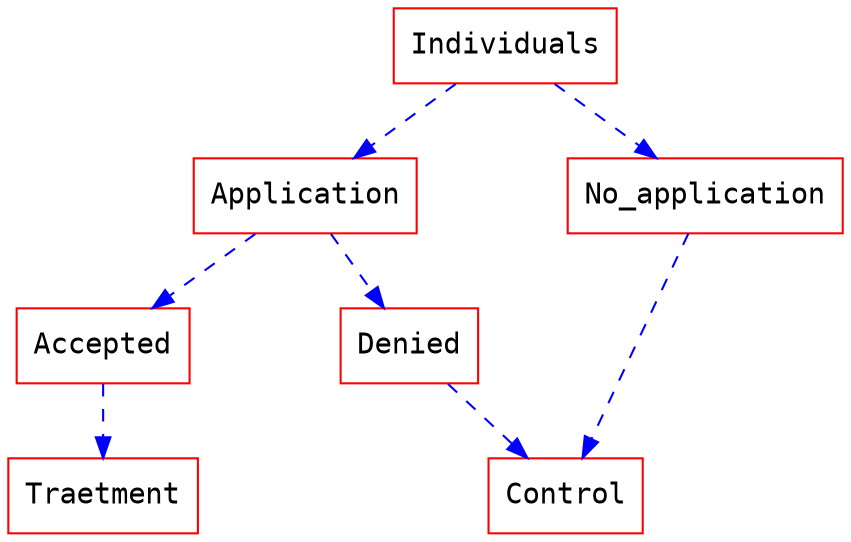

# An Econometric Approach by Propensity Score 

## A brief review behind the model

Besides the classical Ordinary Least Square (OLS) in econometrics estimation, the approach by Propensity Score is widely used to develop research in the area of policy evaluation and measurement of the impact of some treatment. The technique of propensity score is used when the assumption of random distribution of treatment is not applied. In this case, when we use Ordinary Least Square the coefficient estimated will not be the true expected value because it will carry the correlation of not being a random distribution.

OLS approach: 

$$ Y = \mathbb X\beta + \delta Treatment + \mu $$

$$ \mathbb{E} (\delta) = \frac { \sum_{i=0}^n (Tratament_i-\bar{Tratament_i})y_i } {\sum_{i=0}^n (Tratament_i-\bar{Tratament_i})²} $$

Where **X** is a matrix with $n$ variables and $i$ individuals and $\beta$ is a vector with the inclinations of the parameters estimated. In this case, when the goal of the analysis is just to calculate the result of a treatment, the first order condition brings $\delta$ as our parameter of interest. 

First order condition:

$$ \frac {\partial Y }{\partial Treatment} = \ \delta $$

In other words:

$$ Average \ Effect =  \mathbb{E}(Y | treatment= 0)  - \mathbb{E}(Y | treatment= 1) = \delta$$ 

But to get this result, the treatment can not be correlationated with the action of receive or not receive the treatment. The assumption of randomize distribution of the treatment implies that the expected value of the both groups would be the same if there was or was no receive the treatment. Mathematically this means that: 

$$ \mathbb{E}(Y_{(t-1)} | treatment= 0)  - \mathbb{E}(Y_{(t-1)} | treatment= 1) = 0 $$

Where $(t-1)$ would be the period before the treatment selection. It's important to note that in most of the case the data set don't have the prior period to compare the results before and after the policy. If the research have this kind of data that follow the individual before and after the policy, other instruments, like Fixed Effects or Random Effects could be more efficient than Propensity Score Matching.

The Propensity Score Matching comes as a solution when the data set does not follow the individual and we know that the treatment was not random. In order to remove the selection bias from the expected value of the result, the technique of pairing aim to search for agents treated and controlled based on their observable characteristics ($X$).

To illustrate this case, let's suppose a governmental policy that gives a scholarship for some students. In order to receive this scholarship the student must to prove some knowledge making some test. The success in this phase allows the student to recive the scholarship. After the policy has been implemented, the politician wants to know the impact of scholarship in the quality of developing research. To do that, he compare the results of all students, as a control, with the students who received the scholarship. 

The question that remains here is, it's reasonable suppose that the treatment group and the control group have the same expected quality developing researches? Comparing the two groups as they are similar implies that, without the treatment, the expected result of both must be the same. Instead of that, the process to achieving the treatment probability implies that:

$$  Pr(\vec x_i) = \mathbb{P}(treatment= 1 |\vec x_i) $$

$$ \mathbb{E}(Y_{(treatment=1)} | \mathbb {X} )  - \mathbb{E}(Y_{(treatment=0)} | \mathbb X ) \neq 0 $$

Angrist and Pischke (2009) point out that the estimation by propensity score occurs in two steps: first, it is estimated with some parametric model, such as *Probit* or *Logit*. Then, the estimation of the treatment effect can be computed either by matching the value found in the first step or using some weight scheme. Therefore, the matching technique, propensity score matching, compares the effects in the matched groups, differing only by the defined control variable.

Propensity Score Matching (PSM) is a statistical matching tool that tries to estimate the Average Treatment Effect (ATT), assuming a probable selection bias. The conditional probability of receiving treatment is calculated to try to imitate randomization, that is, to produce an experiment analogous to randomization, pairing similar individuals based in the observed characteristics, differentiating only in the treatment. Doing that, the propensity score gives a balancing score, meaning  among subjects with the same propensity to be exposed, treatment is conditionally independent of the covariates. 

Rather than treatment is randomize, the Propensity Score suppose the Conditional Independence Hypothesis, that is an easier assumption to avoid the selection bias. The hypothesis follows this structure: 

$$  \mathbb{E}(Y_{(t=0)} | \mathbb X, t ) = E(Y_{(t=0)} | \mathbb X ) $$
$$  \mathbb{E}(Y_{(t=1)} | \mathbb X, t ) = E(Y_{(t=1)} | \mathbb X ) $$
$$ \mathbb X_i \bot t_i | Pr(x_i)  \therefore  ( Y_{(0)}, Y_{(1)}) \bot t | Pr(x)  $$

Where $t$ is the treatment, and $Pr(x)$ is the propensity score. Conditional to the propensity score, covariates are independent of participation in the treatment. Therefore, for observations with the same propensity scores, the distribution of covariates must be the same in both groups. Depending on the propensity score, each individual has the same probability of participating in the treatment, as in a random experiment.

$$ \tau_{att} = \mathbb{E} \Biggl[\frac{(t-Pr(x))y}{\delta(t-Pr(x))}\Biggl]  $$ 

$$ \hat\tau_{att}  =  \frac{ \sum_{i=0}^n [(t_i-\hat p(x))y_i] }{\sum_{i=0}^n [\hat \delta(t_i-\hat p(x))]} $$

Where $δ = Pr(t=1)$ and:

$$  \hat \delta = \frac{1}{n} \sum_{i=0}^n t_i$$

 In this way, any difference in outcome between the exposed and unexposed individuals is not attributable to the measured intercorrelation. Then the average difference in the results over the two groups is compared to obtain the true expected effect of the program treatment.
 
Although the method of pairing by propensity score is limited to the variables present in the database. When the potential gain of a pairing is related with an intrinsic and unobserved characteristic, the pairing technique does not solve the problem and does not make the modeling closest to the true expected value.

## PSM to measure the gender gap in wages

For this example, a model was created with datas from the Pesquisa Nacional por Amostra de Domicílios (National Household Sample Survey - PNAD / IBGE) 2015 and 2014, and to achieve the results were used Ordinary Least Squares (OLS) and Propensity Score Match (PSM) as econometric’s methods of estimation.

One of the arguments that supports the wage gap is the existence of a discriminatory factor for economic agents, imposing a different wage for individuals with the same marginal productivity.  In an attempt to minimize the effect of selection bias and measure the impact of motherhood more closely to the true population value, we used the method of matching by propensity score. Assuming that all hypotheses are satisfied for each value of the propensity score, the measurement of the Average Treatment Effect (ATT) will converge to the true expected value of the treatment.

The example measure the impact in 3 different models:

Being i equal to the mother's group referring to the child's age and $\mathbf{X}$ the matrix of characteristics of the individuals in the sample, which are: age, age squared, years of study, years of study squared, south, southeast, north , northeast, black, white, brown, yellow, lives with spouse, potential experience and natural income logarithm of the household. $Y$ is equal to natural logarithm of income, and $\beta$ the slope parameter determined by the model.

To create the wages determination model, the wage were transformed in natural logarithm scale. This approximates the sample distribution to the normal distribution, resulting in greater robustness of the results obtained and providing greater efficiency in the inference of the tests. 

Regressions can be influenced by peak distribution, outliers, scale, among others. Then, in order to approximate a normal distribution, the application of the transformation can draw nearer this distribution. Note that despite losing efficiency, the PSM estimator does not need the assumption of normality to be an unbiased and consistent estimator.

As shown in the previous table, in the general sample, comparing men to women, after the pairing method, the wage gap increases, growing from -26\% to -38\%. This implies that, when individuals are paired by the propensity score method, the woman variable is the only variable that differentiates between groups, and when comparing individuals with the same characteristics, being a woman would imply a salary 38\% less than men's wages and not just 26\%.

In the second model, where only men and women without children are analyzed, the disparity also increases after matching, from -17\% to -24\%. Despite having a smaller magnitude, when comparing with the previous model, where men's salaries are compared to the salaries of all women, there is still a large and statistically significant difference between the OLS estimation and PSM estimation.

In the third model, the analysis is between the wages of women without children and the wages of mothers. In a sense, there is not such a big difference in the last group, where women without children are compared with women with children. This result may be a consequence of a more homogeneous sample, where only women are compared. Therefore, the need for pairing is more critical when the model proposes to isolate the impact of treatment between more distinct groups.

### Conclusion

The aim of this study was to demonstrate and compare the results obtained when regressing a model without pairing and a model with pairing. For estimate by propensity score, first a logistic was created to find the probability of an individual receive the treatment, reducing the selection bias. Then, in a second stage, with the probability estimation the values was regressed to calculate the slope of the parameter of interest. In this way, it is more reliable to infer that the real impact in the salary remuneration is closer to the calculated values by the propensity score match method than by the direct result of the regression by ordinary least squares.

Although the instrument provides a good way to isolate the selection bias, the PSM estimation method is limited to an estimation under observable variables. In this context, when the differences between individuals are not differences that are quantified in the database, approaching individuals with the same observable characteristics but with unobserved intrinsic differences, the approach by PSM may not solve the selection bias and then it will suffer the same issues of the simple OLS estimation.

